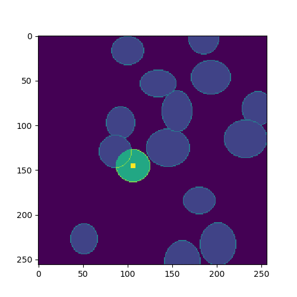

# Moving Actor Segmentation

This repository is about a series of small experiments, using simulated data.
The goal is to create a mask following the "moving actor", which is indicated
by a small marker. I will use the following architectures (using tensorflow/keras):
* Proof of concept (using a simple CNN and constant marker)
* RCNN (marker only in first frame)
* 3D CNN (marker only in first frame)

In further experiments, the simulation will be advanced (for example different noise levels, color channels). Additional steps might include testing models trained on simulated data on real data. And how these might be improved by using pretrained data.

## The problem
Here is an example image. The small square indicates the actor, the whole series of images, as well as the marker serve as inputs, the mask is the target of the classifier. In future versions of the repository, the agent will only be marked in the first frame.

